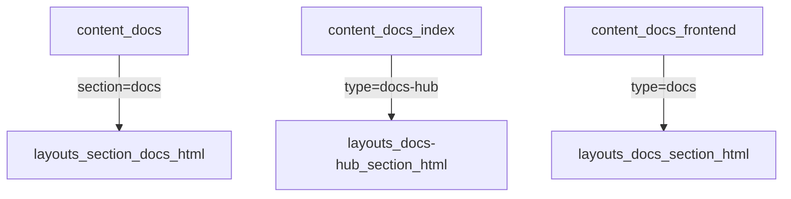

+++
title = "为 Hugoplate 添加多文档系统"
description = "记录如何基于 Hugo 和 Hugoplate 从零设计并实现一个性能优雅、结构清晰的多文档体系"
date = 2025-05-31T15:00:00+08:00
tags = ["hugo", "hugoplate", "技术博客", "前端文档", "yaml", "静态博客"]
categories = ["技术笔记", "博客搭建"]
slug = "hugoplate-docs-extension"
author = "swfoodt"
draft = false
showToc = true
tocSticky = true
+++

### 为 Hugoplate 增加多文档系统的实践记录与原理解析

在使用 Hugo 构建个人博客的过程中，尝试为 Hugoplate 模板添加一个“多文档体系”功能，用于维护结构化的学习笔记。最终实现：

- 使用 `data/*.yaml` 构建清晰的文档结构
- 将文档总览页与单文档页分开模板控制
- 利用 partial 函数递归渲染章节结构
- Tailwind 美化并响应式布局

本文记录这个过程的原理、方案、模板机制、调试方法与样式优化。

---

### 1. Hugo 的核心渲染机制理解

Hugo 的渲染模型可以简要拆分为：

| 组成 | 功能说明 |
|------|----------|
| `content/` | 用于存放 Markdown 内容源 |
| `layouts/` | 渲染模板，决定如何展示内容 |
| `data/` | 自定义结构化数据（YAML/JSON） |
| `static/` | 存放不需渲染的静态资源 |
| `params` | 在 `config.toml` 或 front matter 中定义的全局/局部变量 |

Hugo 根据 `.Type`、`.Section`、`.Kind` 三个字段决定模板匹配策略：



---

### 2. 第一次尝试：用 front matter 构建文档结构

**结构思路：**

- 在博客文章 front matter 中加入自定义字段
  ```toml
  doc: frontend
  section: html
  ```
- 使用 `where` 在模板中过滤博客
- 手动构造层级结构渲染

**缺陷：**

- 不适合多文档并存的结构
- 每次渲染都要遍历 `.Site.RegularPages`，性能低
- 页面耦合字段结构，难以维护和迁移

---

### 3. 改进：使用 `data/*.yaml` 显式定义文档结构

选择 `data/docs/*.yaml` 来维护文档结构：

#### 示例：`data/docs/frontend.yaml`

```yaml
title: 前端开发
description: HTML/CSS/JS 笔记合集
sections:
  - title: HTML 入门
    pages:
      - title: 标签概述
        path: /post/html-tags/
    sections:
      - title: HTML 基础
        pages:
          - title: 块与行元素
            path: /post/html-block-inline/
  - title: CSS 精要
    pages:
      - title: Flex 布局
        path: /post/css-flex/
```

此结构支持任意嵌套层级，适合体系化内容。

---

### 4. Hugo 模板匹配机制与 type 的作用

在 Hugo 中，模板的选择规则如下：

| 页面来源 | 类型 | 匹配模板 |
|----------|------|-------------|
| `content/docs/_index.md` | type = `docs-hub` | `layouts/docs-hub/section.html` |
| `content/docs/frontend/_index.md` | type = `docs` | `layouts/docs/section.html` |

所以使用 `type` 将文档总览页与具体文档页面模板逻辑区分开来。

此外，还在 `frontend/_index.md` 中添加了 `slug` 字段：

```toml
slug = "frontend"
type = "docs"
```

方便在模板中通过 `.Params.slug` 精准索引 `site.Data.docs`.

---

### 5. 实现核心结构

#### 文档总览页模板：`layouts/docs-hub/section.html`

```html
<section class="max-w-5xl mx-auto px-6 py-12">
  <h1 class="text-4xl font-bold text-center mb-12">文档总览</h1>
  <div class="grid grid-cols-1 sm:grid-cols-2 lg:grid-cols-3 gap-6 justify-items-center">
    {{ range $name, $doc := site.Data.docs }}
      <a href="/docs/{{ $name }}/" class="w-full max-w-sm block p-6 rounded-xl border border-gray-200 shadow-sm bg-white hover:shadow-md transition">
        <h2 class="text-xl font-bold text-gray-900 mb-2">{{ $doc.title }}</h2>
        <p class="text-gray-600 text-sm leading-relaxed">{{ $doc.description }}</p>
      </a>
    {{ end }}
  </div>
</section>
```

#### 单文档页面模板：`layouts/docs/section.html`

```html
{{ define "main" }}
<section class="max-w-6xl mx-auto px-6 py-12">
  {{ $slug := .Params.slug }}
  {{ $doc := index site.Data.docs $slug }}

  <h1 class="text-4xl font-bold text-center mb-6">{{ $doc.title }}</h1>
  <p class="text-gray-500 text-center mb-10">{{ $doc.description }}</p>

  <div class="flex justify-center">
    <div class="w-full max-w-3xl space-y-6">
      {{ range $doc.sections }}
        {{ partial "docs/section-item.html" . }}
      {{ end }}
    </div>
  </div>
</section>
{{ end }}
```

#### 递归渲染 partial：`layouts/partials/docs/section-item.html`

```html
<div class="bg-gray-50 rounded-xl p-5 border border-gray-200">
  <h2 class="text-2xl font-semibold mb-3">{{ .title }}</h2>
  <ul class="list-disc pl-5 space-y-1">
    {{ range .pages }}
      <li>
        <a href="{{ .path }}" class="text-gray-800 hover:text-indigo-600 hover:underline transition">
          {{ .title }}
        </a>
      </li>
    {{ end }}
  </ul>
  {{ if .sections }}
    <div class="mt-4 space-y-4">
      {{ range .sections }}
        {{ partial "docs/section-item.html" . }}
      {{ end }}
    </div>
  {{ end }}
</div>
```

partial 的使用可以将递归逻辑解耦，让模板结构更清晰、易测试、可多处复用。

---

### 6. 调试技巧与路径匹配陷阱

- 使用 `.Type` `.Kind` `.Section` 在页面中输出检查
- 可用 `hugo --debug` 查看模板匹配流程
- `_index.md` 默认 `kind = section`，不走 `list.html`，而是走 `section.html`
- `.Params.slug` 常用于桥接数据目录与 front matter

---

### 7. 样式优化与自适应布局

#### 总览页卡片布局优化

```html
<div class="grid grid-cols-1 sm:grid-cols-2 lg:grid-cols-3 gap-6 justify-items-center">
```

- `grid-cols-1` 到 `grid-cols-3` 实现响应式
- `justify-items-center` 保证卡片居中
- `max-w-sm` 保证卡片尺寸一致

#### 单文档页面居中优化

- 使用 `max-w-6xl` 控制主内容宽度
- 子文档树包裹在 `max-w-3xl` 区域中
- 每个 `section-item` 使用卡片结构 + 灰色背景增强分隔

---

### 8. 项目结构总览

```bash
content/
├── docs/
│   ├── _index.md          # 文档总览页
│   └── frontend/
│       └── _index.md      # 单文档页面

data/
└── docs/
    └── frontend.yaml      # 文档结构定义

layouts/
├── docs-hub/
│   └── section.html       # 总览模板
├── docs/
│   └── section.html       # 文档内容模板
└── partials/
    └── docs/
        └── section-item.html  # 渲染子章节
```

---

### 9. 总结

- Hugo 渲染模型是基于「路径 + 类型」精确匹配的静态模板机制
- 文档结构适合使用 data 驱动，而非 page 遍历
- `type` 是多模板结构中最灵活的路由判定键
- 部分 Hugo 抽象设计虽然灵活，但需理解才能有效使用

---

