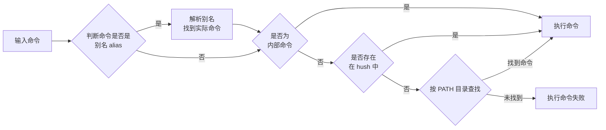

### 终端以及shell


- **终端**： 终端实际上是指处理用户与主机之间输入输出的一种物理设备，在当前的个人电脑中表现为一个界面程序。



 一个主机可能会有多个终端同时工作，也就是多个用户同时使用。与windows不同，win可以有多个用户，但是同一时间只能是一个用户操作。



- **Shell**：Shell 实际上是一种在用户输入与终端之间实现动态交互的程序，也被叫做命令解释器，它会将用户输入的命令进行解析，解释为关键字与参数，然后找到能够处理这条命令的程序。



Shell 有很多种，因为其本质上是一个程序，有各种版本。
常见的有 Bash、Zsh、Fish、Csh、Ksh 等。


<hr>

### 主机名（Hostname）
设置主机名：
- `hostname NAME` 临时生效
- `hostnamectl set-hostname NAME` 持久生效



主机名通常根据不同的使用场景要反应出主机的重要信息。

命令中的 `ctl`结尾，意味着 **controller** ，控制设置某些内容。


<hr>

### 命令提示符（prompt）


每次输入命令前终端显示的一段提示符，可以使用 `echo $PS1` 来查看当前的命令提示词构成（通常由转义字符组成），可以进行自定义以便于实际使用。



实用的醒目提示符 (持久生效，对于ubuntu来说是当前用户，对于rocky是所有用户)
``` bash
# Ubuntu
echo "PS1='\e[31;1m[\u@\h:\w]\$\e[0m '" >> .bashrc
# Rocky
echo "PS1='\e[31;1m[\u@\h \W]\\$ \e[0m'" > /etc/profile.d/env.sh
```



<hr>


### 执行命令
#### 执行命令流程



- 别名：对于冗长指令的简化定义
- 内部命令：指shell中自带的命令
- 外部命令：指存储在文件系统中的可执行文件
- hash：外部命令通常存储在磁盘上，读取速度慢，当被命中后，会被存入hash缓存表，以便于下一次快速读取


<hr>

### 命令格式

#### 标准格式结构

- **COMMAND  [OPTIONS...] [ARGUMENTS...]**
- **COMMAND [COMMAND] [COMMAND ]**


- []：表示可选
- ... ：表示可以有多个选项或参数
- OPTIONS：选项，通常是命令的修饰符，用于改变命令的行为
- ARGUMENTS：参数，通常是命令的操作对象，如文件名、目录名等


#### 命令行风格

- 短选项（UNIX）：由`-`与单个字母组成，如`-l`,`-h`，可以直接组合`-lh`
- 长选项（GNU）：由`--`与单词组成，如`--all`,`--work`，无法组合
- BSD风格：由单个字母组成，如`a`，不常见


多个命令可以用 ";" 符号分开  
取消和结束命令执行：Ctrl+c，Ctrl+d  


<hr>

#### 多命令串联

Linux 中多个命令可以使用逻辑操作符组合执行：

| 操作符 | 含义                             | 示例                      |
|--------|----------------------------------|---------------------------|
| `;`    | 顺序执行，不管前一个是否成功     | `mkdir a; cd a`           |
| `&&`   | 前一命令成功才执行下一条命令     | `make && make install`    |
| `\|\|`   | 前一命令失败时才执行下一条命令   | `command \|\| echo "失败"` |
| `\|`    | 管道，将前一命令输出传给下一命令 | `ls -l \| grep test`       |


逻辑操作符是日常脚本与命令行操作中的“粘合剂”。


<hr>

### Linux 常用查询与工具命令

#### 系统信息与操作命令分类表

##### 1. 硬件信息查看

| 命令                   | 功能说明                 |
|------------------------|--------------------------|
| `lscpu`               | 查看 CPU 架构信息        |
| `cat /proc/cpuinfo`    | 查看 CPU 详细参数        |
| `free`                 | 查看内存使用情况         |
| `cat /proc/meminfo`    | 查看内存详细数据         |
| `lsblk`                | 查看硬盘和分区情况       |
| `cat /proc/partitions` | 查看系统分区表信息       |

<hr>

##### 2. 系统版本信息

| 命令                  | 功能说明                         |
|-----------------------|----------------------------------|
| `arch`                | 查看系统架构（如 x86_64）        |
| `uname -r`            | 查看内核版本                     |
| `cat /etc/os-release` | 查看操作系统发行版本             |

<hr>

##### 3. 日期和时间

| 命令      | 功能说明                          |
|-----------|-----------------------------------|
| `date`    | 显示或设置系统时间                |
| `clock`   | 传统时间管理工具                  |
| `hwclock` | 访问硬件时钟（BIOS 时间）         |

<hr>

##### 4. 关机和重启

| 命令              | 功能说明                          |
|-------------------|-----------------------------------|
| `halt`            | 立即关机                          |
| `poweroff`        | 关闭电源                          |
| `shutdown -h now` | 立即关机（支持延迟）             |
| `reboot`          | 立即重启                          |
| `init 6`          | 切换至运行级别 6（重启）         |
| `shutdown -r now` | 立即重启（支持延迟）             |

<hr>

##### 5. 用户登录信息

| 命令       | 功能说明                         |
|------------|----------------------------------|
| `whoami`   | 显示当前用户名                   |
| `who am i` | 显示当前终端登录信息             |
| `who`      | 列出所有已登录用户               |
| `w`        | 显示用户及进程信息               |

<hr>

##### 6. 工具类命令

| 类别       | 命令     | 功能说明                      |
|------------|----------|-------------------------------|
| 文本编辑   | `gedit`  | GNOME 图形界面编辑器          |
|            | `nano`   | 命令行简易编辑器              |
| 会话管理   | `screen` | 创建持久化会话                |
|            | `tmux`   | 终端复用工具                  |
| 输出信息   | `echo`   | 打印文本或变量内容            |

<hr>

##### 7.命令定位工具

| 命令        | 功能说明                      |
|-------------|-------------------------------|
| `which`     | 查看外部命令实际路径          |
| `type`      | 查看命令是内建、别名或路径    |
| `command`   | 与 `type` 类似，略有差别      |

<hr>

### 使用辅助

#### Tab 键补全

- 点击一次：补全命令或路径（结果唯一时自动完成）  
- 点击两次：列出所有可能的补全选项  

<hr>

### 如何获取帮助

#### Shell 内建帮助（Shell Builtin Commands）

| 命令/语法            | 功能说明                                             | 使用示例         |
|----------------------|------------------------------------------------------|------------------|
| `whatis <command>`   | 显示命令简短描述（需先运行 `mandb` 建立数据库）     | `whatis ls`      |
| `whereis <command>`  | 定位命令的二进制、源码和 man 手册位置               | `whereis python` |
| `help <command>`     | 查看 Bash 内置命令帮助（如 cd/echo 等）             | `help echo`      |
| `man bash`           | 查阅完整的 Bash 使用手册（包含所有内置命令说明）    | `man bash`       |

<hr>

#### 外部程序帮助（External Commands）

##### 基础帮助选项

| 语法               | 说明                         | 特点                     |
|--------------------|------------------------------|--------------------------|
| `<command> --help` | 大多数 GNU 工具的标准帮助选项 | 简洁，显示常用参数       |
| `<command> -h`     | 有些工具的简写帮助选项        | 同 `--help`，但可能更少  |

<hr>

##### 文档系统（man/info/tldr）

| 命令              | 功能                           | 对比说明                         |
|-------------------|--------------------------------|----------------------------------|
| `man <command>`   | 标准 UNIX 手册系统             | 按章节组织（1=命令，5=配置等）   |
| `info <command>`  | GNU 超文本文档系统             | 支持节点跳转，结构更详细         |
| `tldr <command>`  | 社区简明手册（需安装 `tldr`） | 提供实用示例，适合快速查询       |

<hr>

#### 软件自带本地文档路径（示例）

```bash
# 常见文档目录
/usr/share/doc/<package>/
/usr/local/share/doc/
<software_install_path>/README.md
```


